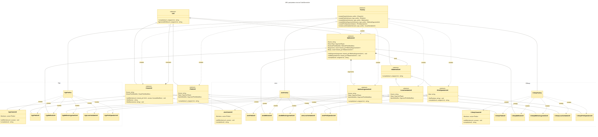

# CodeGeneration

Проект для программной генерации исходного кода на C++, Java и C#. Клиентский код строит модель класса из полей, методов, аргументов и операторов, после чего вызывает `compile()` и получает текст исходного кода нужного языка.

## Возможности

- генерация объявлений классов, полей и методов;
- поддержка аргументов методов, локальных переменных и операций вывода;
- модификаторы доступа, типов и префиксов (`static`, `const`, `final` и другие);
- три семейства реализаций: C++, Java и C#;
- создание объектов через паттерн **Абстрактная фабрика**.

## Архитектура

Базовые классы находятся в `lib/interfaces`:

- `Unit` — общий интерфейс элемента, который умеет генерировать код методом `compile()`;
- `IClassUnit`, `IFieldUnit`, `IMethodUnit` — модель класса, поля и метода;
- `IMethodArgumentUnit`, `ILocalVariableUnit`, `IPrintOperatorUnit` — составные элементы метода;
- `IFactory` — абстрактная фабрика, создающая элементы одного языка.

Конкретные реализации расположены в каталогах `lib/Cpp`, `lib/Java` и `lib/CSharp`. Классы `CppFactory`, `JavaFactory` и `CSharpFactory` создают согласованные наборы соответствующих объектов.

UML-диаграмма классов:




## Сборка

```bash
cmake -S . -B build
cmake --build build --config Release
```

## Запуск

Основная демонстрационная программа:

```bash
./build/Release/CodeGeneration.exe
```

Программа с расширенными сценариями для C++, Java и C#:

```bash
./build/Release/CodeGenerationTests.exe
```


## Пример использования

```cpp
std::shared_ptr<IFactory> factory = std::make_shared<CppFactory>();

auto classUnit = factory->createClassUnit("Example"); // создание класса с именем "Example"
auto method = factory->createMethodUnit("run", Modifiers::ArgumentTypes::VOID); // создание метода с именем "run" с типом void
auto print = factory->createPrintOperatorUnit("Hello!"); // создание оператора вывода с текстом "Hello!"

method->addBody(print); // добавление оператора вывода в метод
classUnit->addMember(method, Modifiers::AccessModifiers::PUBLIC); // добавление метода в класс в секцию public

std::cout << classUnit->compile(); // генерация строки с кодом и вывод этой строки
```

Результат — текст класса C++ с открытым методом `run`, выводящим строку `Hello!`.

## Структура проекта

```text
lib/
  interfaces/  Базовые интерфейсы элементов генерации
  Factory/     Интерфейс и реализации абстрактной фабрики
  Cpp/         Генераторы синтаксиса C++
  Java/        Генераторы синтаксиса Java
  CSharp/      Генераторы синтаксиса C#
  utils/       Модификаторы и вспомогательные функции
main.cpp       Минимальный пример использования
test_main.cpp  Расширенные демонстрационные сценарии
```
